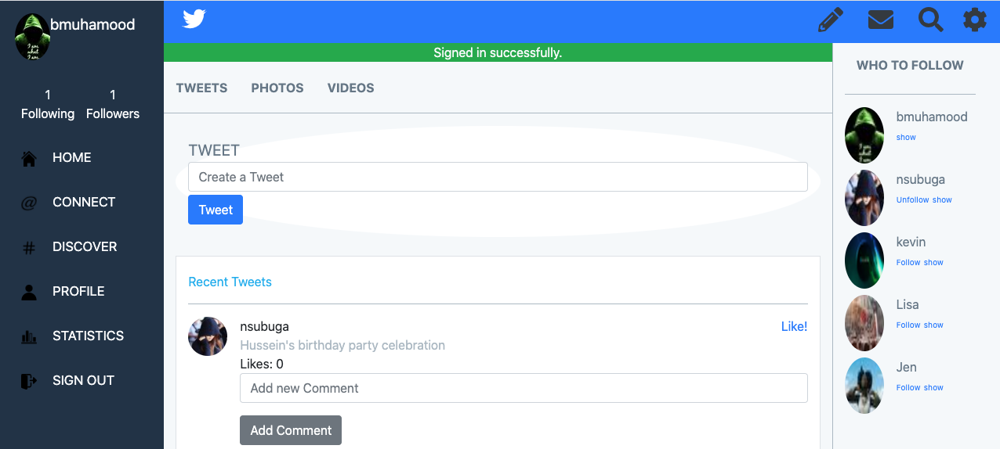

# Twitter Redesign

> The project screenshot



## Description

This is a Capstone project of clone of Twitter design from Gregoire Vella , in this project you have some of the basic features
and I add a different ones, you can create your user, follow people and be followed, you can post whatever 
you want like how you feel today , some of the extra features is the comments part that it is after every 
posts in the home page, also you can like or dislike a posts and you will se the number of likes that a post have. 

## Built With

- Ruby v2.7.2
- Ruby on Rails v6.o.3.3

## Live Demo

[Live Demo!!!](https://twitter-design.herokuapp.com/users/sign_in)

You have to Sign up to acces to de home page and interact with other users


## Getting Started

To get a local copy up and running follow these simple example steps.

### Prerequisites

Ruby: 2.7.2
Rails: 6.0.3.3
Postgres: >=9.5

### Setup
Clone Repo with:
```
git clone 
```


Instal gems with:

```
yarn install --check-files
```
Install yarn 
```
bundle install
```

Setup database with:

```
   rails db:create
   rails db:migrate
```

### Usage

Start server with:

```
    rails server
```

Open `http://localhost:3000/` in your browser.

### Run tests

To run the tests just excecute this command from the root project folder

```
    rspec --format documentation
```


## Author

👤 **Bbosa Muhamood**

- Github: [@bmuhamood](https://github.com/bmuhamood)
- Linkedin: [linkedin](https://www.linkedin.com/in/bbosa-muhamood-06845576/)

## 🤝 Contributing

Contributions, issues and feature requests are welcome!

Feel free to check the [issues page](https://github.com/bmuhamood/twitter_redesign/issues).

## Show your support

Give a ⭐️ if you like this project!

## Acknowledgments

- Microverse
- Odin Project
- All rights to Gregoire Vella on Behance.

## 📝 License

This project is [MIT](https://opensource.org/licenses/MIT) licensed.
